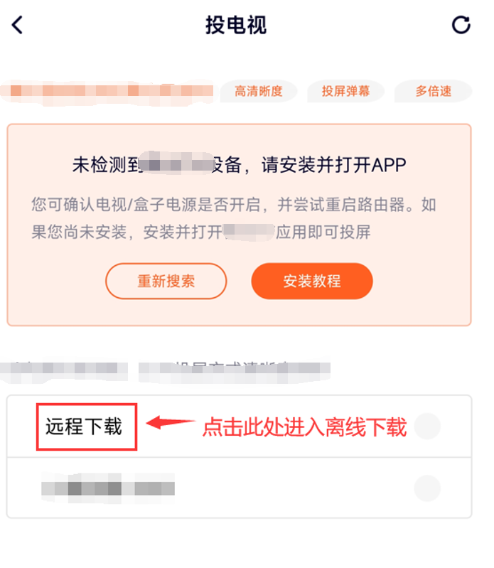

### 简介

DLNA 最早由索尼、英特尔、微软等公司提出的一个局域网媒体资源互通协议，使用 DLNA 可以做到例如将手机上的视频投屏到电视上播放等操作。

早些时候，我注意到在一些手机 APP 上把视频投屏到电视上播放，即使关掉手机，电视上的内容也不会中断。于是我猜测，电视应该是收到了手机推送的一个 URL 直接播放，并非再通过手机进行中转。如果我能截取到这个 URL，是不是就意味着我可以直接下载该视频了。

事实证明我是对的，我在 wireshark 中抓包验证了这一观点。于是就有了此项目的诞生，**一个基于 DLNA 的视频下载器！支持各大视频门户，只要是可以投屏的都可以下载。**

### 原理

原理大概是这样：

路由器上有个叫 UPNP 的服务，这个服务有个关键协议叫 SSDP，SSDP 是一种简单服务发现协议。这就意味着局域网内的设备可以通过 SSDP 上报自己的存在以及自己支持的服务，同样的，也可以在局域网中寻找自己感兴趣的设备。

1. 手机投屏的时候会在局域网内广播自己的需求（视频播放服务）

2. 电视接受到广播后发现自己符合条件，则会直接给手机发送一个报文，报文内携带了一个指向电视服务描述的 url。

3. 手机接收到报文后，访问这个 url，得到电视的设备描述信息，描述信息里又有一组另外的 url，每个 url 对应着电视的一个功能。找到对应的功能后，手机会访问这个 URL 并将视频地址上传（POST）到电视端。

4. 电视端拿到视频地址后进行播放。

### 安装

部分网站推送的视频为 m3u8，下载后需要使用 ffmpeg 合并。

下载地址：https://www.aliyundrive.com/s/CrvyspD8CW7 提取码: k2m8

下载后需自行配置环境变量，保证 `ffmpeg -h` 能够正常打印帮助信息。

```shell
git clone git@github.com:lengyuxuan/dlna-download.git

cd dlna-download

npm i

tsc -p .

node dist/app.js

```

手机端打开投屏软件，打开你想下载的视频，点击右上角的投屏按钮：


选择自建的投屏服务进行下载：



稍等片刻后，可以在项目目录下的 `download` 中看到下载完成的视频：


代码中我开启了 10 个进程并行下载，1.6G 的资源下载了 40 秒，速度拉满。

> *注：如果手机端未扫描到投屏设备，可在浏览器中访问 `http://localhost:7024/restart` 重启 DLNA 服务。因为没有完成实现 DLNA 的所有功能，所以手机端会提示投屏失败，但并不影响下载。

### 特殊说明

项目是为了学习 DLNA 相关协议开发，禁止一切商用，违者自行承担所有责任，与作者无关。
